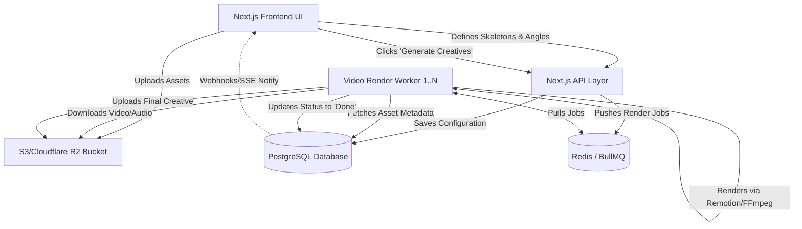

# DropAI - Organic Dropshipping Content Farm Architecture

## Overview
A Next.js based application designed to automate the mass-creation of organic dropshipping video content. It allows users to define video "skeletons" for different marketing "angles" and populate them with interchangeable assets. The engine then automatically swaps elements (hooks, b-rolls, captions, music) to generate multiple unique creatives tailored for platforms like TikTok, Reels, and Shorts.

## Core Concepts (Data Model)
1. **Product/Campaign**: Top-level container for a specific dropshipping item.
2. **Angle**: The marketing direction or psychological hook (e.g., "Problem/Solution", "Unboxing", "UGC Review").
3. **Skeleton (Layout)**: The timeline structure defined for an angle in a video-editor-like UI (e.g., `Hook (0-3s)` -> `B-Roll (3-10s)` -> `CTA + Outro (10-15s)`).
4. **Assets**: Categorized media files corresponding to video elements. Users upload assets into buckets (e.g., `Hook_TypeA`, `B-Roll_ProductCloseUp`, `Audio_Trending`).
5. **Creative**: The final compiled video variation generated by the app.

---

## Tech Stack & Separation of Concerns
To ensure scalability (video editing is highly resource-intensive), the architecture clearly separates the client-facing frontend from the processing backend.

### 1. Frontend: The Creator Suite (Next.js App Router)
Strictly focused on UI/UX, built as a modern SPA.
- **Framework**: Next.js (App Router), React, Tailwind CSS
- **Interactive UI**: `dnd-kit` or `framer-motion` for the drag-and-drop video-editor-like Skeleton Builder.
- **Key Modules**:
  - **Angle & Skeleton Builder**: A visual timeline editor where users create *slots* (e.g., dragging a "Hook Slot" into the timeline, instead of an actual video clip).
  - **Asset Manager**: Interface to bulk upload hooks, b-rolls, and audio, and categorize them by asset type.
  - **Output Gallery**: Where generated creatives are previewed and downloaded.

### 2. Backend: API & Orchestration (Next.js / Node.js)
Handles data persistence, queue management, and API routes.
- **Language**: TypeScript / Node.js
- **Database**: PostgreSQL (via Supabase or Prisma) to store users, configurations, asset metadata, and skeleton definitions.
- **Storage**: AWS S3, Cloudflare R2, or Supabase Storage for storing massive unedited 4K/1080p clips and final `.mp4` outputs.
- **Queue System (Crucial)**: Redis + BullMQ (or similar). When a user requests 50 creatives, the API doesn't process them synchronously. It creates 50 background jobs to prevent HTTP timeout.

### 3. Layer 01: The Video Rendering Engine (Worker)
A heavily separated background worker that does the actual media manipulation.
- **Tech Option A - Remotion (Recommended for Complex Captions)**: Write video compositions in React. Excellent for dynamic text, complex animations, and precise layouts. 
- **Tech Option B - FFmpeg (Recommended for Speed/Simplicity)**: Command-line media processor to quickly concatenate MP4s, strip/add audio tracks, and add standard subtitles. Much faster for just joining hooks and b-rolls.
- **Responsibility**: Listens to the queue, downloads required assets from S3, applies logic (e.g., select random hook + random b-roll + specific audio track), renders the final video, uploads back to S3, and marks the Creative as "Done" in the database.

---

## System Architecture Blueprint



---

## The User Flow

1. **Ingest**: User creates a Campaign for "Posture Corrector".
2. **Asset Uploading**: User uploads 10 different opening hooks, 15 pieces of B-Roll, and 3 trending audio tracks. They categorize every file natively.
3. **Skeleton Definition**: User goes to the "TikTok Aggressive" Angle. In the editor interface, they drag in elements:
   - `00:00 - 00:03`: **Hook Element** (Text Override: "Stop scrolling...")
   - `00:03 - 00:08`: **B-Roll Element**
   - `00:00 - 00:08`: **Audio Element**
4. **Generation**: The Engine permutations the combinations. (Hook #1 + B-Roll #4 + Audio #2), etc.
5. **Review**: The dashboard updates dynamically as the background workers finish rendering. User curates the best ones and exports them.

---

## Recommended Repo Structure (Monorepo)
```text
/drop-ai-monorepo
├── apps/
│   ├── web/                     # The Next.js frontend and lightweight API routes
│   └── render-worker/           # Dedicated Node.js microservice running Remotion/FFmpeg
├── packages/
│   ├── database/                # Prisma schema and shared types
│   ├── config/                  # Shared ESLint/TS configs
│   └── video-engine-logic/      # Logic determining mapping of Skeletons -> FFmpeg commands
```
